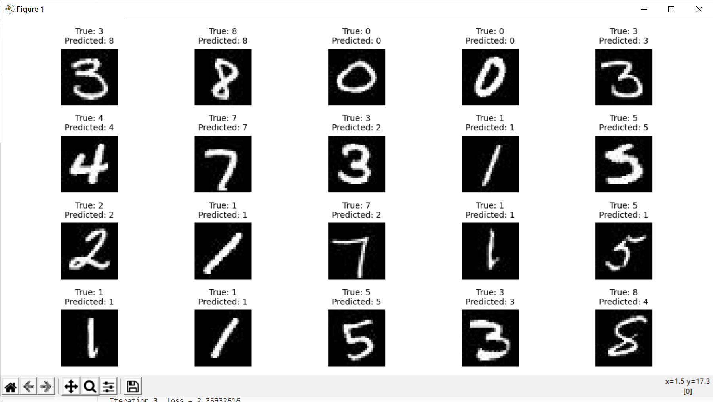
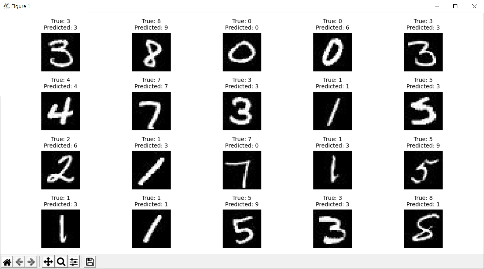

# 数据来源
见当前目录下train、test文件夹

# 描述样本的数量、各类样本的分布情况

* **训练样本数量**：100

* **测试样本数量**：20

* **类别分布**：数据集中的样本分为10个类别，分别代表数字0到9

# 描述实验内容与步骤，包括模型与参数设置等

## 实验内容

1. 数据加载

   ```python
   X_train_custom, y_train_custom = load_custom_dataset(image_folder, label_file)
   ```

2. 模型构建

   创建多层感知器人工神经网络模型MLP
   ```python
    mlp_model_custom = MLPClassifier(hidden_layer_sizes=(250, 50), max_iter=10, alpha=1e-4, solver='sgd', verbose=10, tol=1e-4, random_state=1, learning_rate_init=0.05,activation='relu')
   ```

3. 模型训练

    ```python
    mlp_model_custom.fit(X_train_custom_scaled, y_train_custom)
    ```

4. 模型预测

    ```python
    predictions_custom = mlp_model_custom.predict(X_test_custom_scaled)
    ```

5. 模型评估

    ```python
    print("自定义数据集准确率：", accuracy_custom)
    ```

## 模型参数设置

```python
mlp_model_custom = MLPClassifier(hidden_layer_sizes=(250, 50), max_iter=10, alpha=1e-4, solver='sgd', verbose=10, tol=1e-4, random_state=1, learning_rate_init=0.05,activation='relu')
```

* **隐藏神经元数量`hidden_layer_sizes`**：第一层200、第二层100
* **最大迭代次数`max_iter`**：10
* **正则化参数**`alpha=`：1e-4
* **优化算法`solver`**：随机梯度下降
* **激活函数**：使用ReLU
* **学习速率**`learning_rate_init`**：0.1

# 完整代码
```python
from PIL import Image
import numpy as np
from sklearn.neural_network import MLPClassifier
from sklearn.metrics import accuracy_score
from sklearn.preprocessing import StandardScaler
import matplotlib.pyplot as plt

# 读取图片和标签文件
def load_custom_dataset(image_folder, label_file):
    images = []
    labels = []
    with open(label_file, 'r') as file:
        lines = file.readlines()
        for line in lines:
            image_name, label = line.strip().split(' ')
            image_path = f"{image_folder}/{image_name}"
            image = Image.open(image_path).convert('L')  # 转为灰度图像
            image_array = np.array(image).reshape(-1)  # 将图像转为一维数组
            images.append(image_array)
            labels.append(int(label))
    return np.array(images), np.array(labels)

# 设置图像文件夹和标签文件路径
image_folder = 'train'
label_file = 'train.txt'

# 加载自定义数据集
X_train_custom, y_train_custom = load_custom_dataset(image_folder, label_file)

# 创建StandardScaler对象
scaler = StandardScaler()

# 对自定义训练集进行标准化处理
X_train_custom_scaled = scaler.fit_transform(X_train_custom)

# 创建MLP模型
mlp_model_custom = MLPClassifier(hidden_layer_sizes=(250, 50), max_iter=10, alpha=1e-4, solver='sgd', verbose=10, tol=1e-4, random_state=1, learning_rate_init=0.05,activation='relu')

# 训练模型
mlp_model_custom.fit(X_train_custom_scaled, y_train_custom)

# 使用训练好的模型进行预测（这里需要加载测试集的图片并进行处理，类似于训练集的加载过程）

test_image_folder = 'test'
test_label_file = 'test.txt'
X_test_custom, y_test_custom = load_custom_dataset(test_image_folder, test_label_file)
X_test_custom_scaled = scaler.transform(X_test_custom)
predictions_custom = mlp_model_custom.predict(X_test_custom_scaled)
accuracy_custom = accuracy_score(y_test_custom, predictions_custom)
print("自定义数据集准确率：", accuracy_custom)

# 创建一个4行5列的子图，每次迭代绘制一个图像
fig, axes = plt.subplots(4, 5, figsize=(12, 6))
for i, ax in enumerate(axes.flat):
    # 获取当前测试样本的图像、真实标签和预测标签
    sample_image = X_test_custom[i].reshape(28, 28)  # 假设图像大小是28x28
    true_label = y_test_custom[i]
    predicted_label = predictions_custom[i]

    # 绘制图像
    ax.imshow(sample_image, cmap='gray')

    # 设置标题，包括真实标签和预测标签
    ax.set_title(f"True: {true_label}\nPredicted: {predicted_label}", fontsize=10)

    # 隐藏坐标轴
    ax.axis('off')

# 调整子图布局
plt.tight_layout()
plt.show()
```

**运行结果**
```
Iteration 1, loss = 2.84641036
Iteration 2, loss = 2.33942101
Iteration 3, loss = 2.35932616
Iteration 4, loss = 1.88455264
Iteration 5, loss = 1.74601848
Iteration 6, loss = 6.52650814
Iteration 7, loss = 1.41685840
Iteration 8, loss = 2.82465900
Iteration 9, loss = 0.90782322
Iteration 10, loss = 0.58485911
自定义数据集准确率： 0.7619047619047619
```


# 调整模型参数

## 调整神经元层数`(200, 100, 50)`
```python
mlp_model_custom = MLPClassifier(hidden_layer_sizes=(200, 100, 50), max_iter=10, alpha=1e-4, solver='sgd', verbose=10, tol=1e-4, random_state=1, learning_rate_init=0.05,activation='relu')
```
**准确率**明显降低
```
Iteration 1, loss = 2.56073704
Iteration 2, loss = 3.74951758
Iteration 3, loss = 2.44919608
Iteration 4, loss = 2.61640060
Iteration 5, loss = 1.99475380
Iteration 6, loss = 3.32391565
Iteration 7, loss = 3.10139336
Iteration 8, loss = 6.04168339
Iteration 9, loss = 3.13613505
Iteration 10, loss = 3.36420255
自定义数据集准确率： 0.42857142857142855
```


## 调整激活函数
尝试改变激活函数，分别使用`logistic`、`tanh`，得到的准确率不足0.2